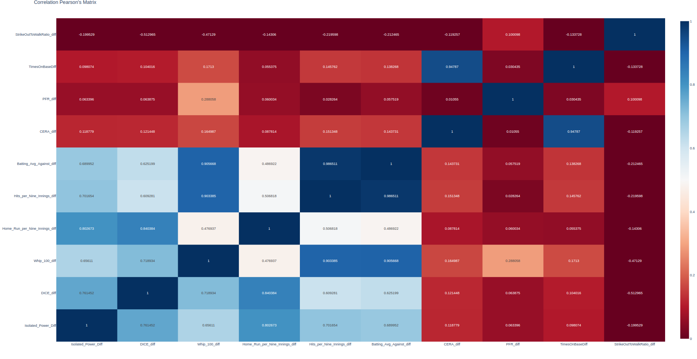
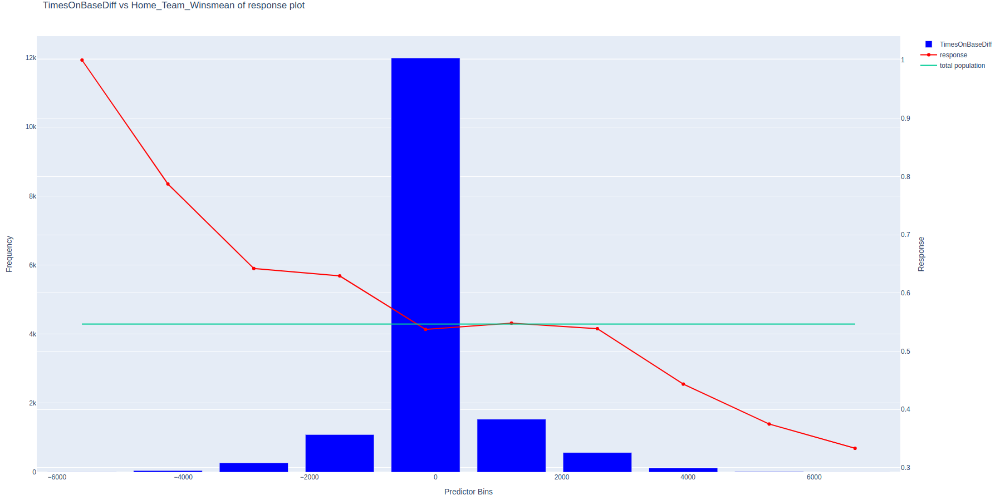
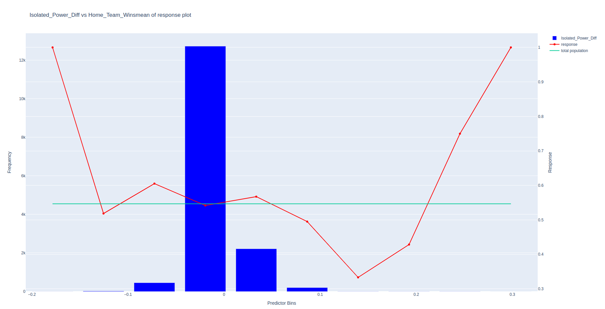
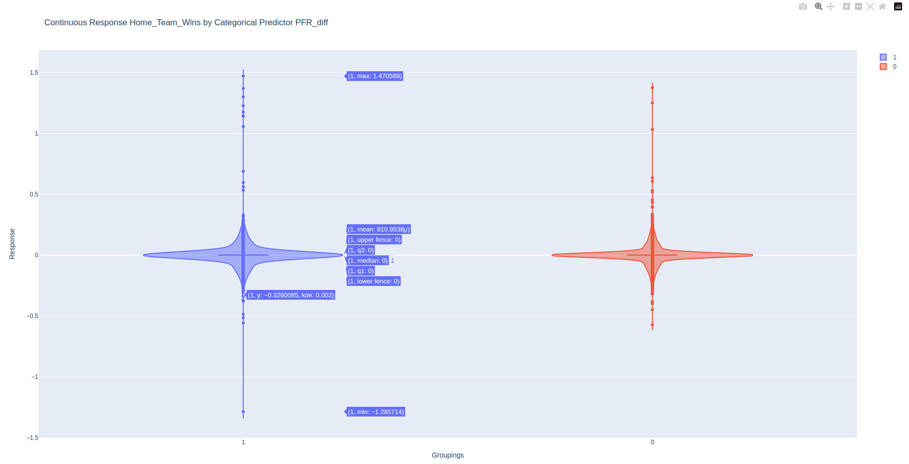

# PythonProject

# Setup for developement:

- Setup a python 3.x venv (usually in `.venv`)
  - You can run `./scripts/create-venv.sh` to generate one
- `pip3 install --upgrade pip`
- Install pip-tools `pip3 install pip-tools`
- Update dev requirements: `pip-compile --output-file=requirements.dev.txt requirements.dev.in`
- Update requirements: `pip-compile --output-file=requirements.txt requirements.in`
- Install dev requirements `pip3 install -r requirements.dev.txt`
- Install requirements `pip3 install -r requirements.txt`
- `pre-commit install`

## Update versions

`pip-compile --output-file=requirements.dev.txt requirements.dev.in --upgrade`
`pip-compile --output-file=requirements.txt requirements.in --upgrade`

# Run `pre-commit` locally.

`pre-commit run --all-files`

# BASEBALL WIN PREDICTION USING MACHINE LEARNING

## Introduction

Baseball Dataset: The dataset contains Batting, Pitching and Fielding statistics of team. There are numerous tables in this database that contain information about baseball players and teams, including game, box score, team batting, team pitching, and pitcher counts, among others.
Dataset Link:
[Baseball_Dataset](https://teaching.mrsharky.com/data/baseball.sql.tar.gz)

(This database provides data from baseball contests that took place between 2008 and 2012. The dataset is 1.2 Gb in size)

- The goal of this research is to use the baseball dataset to develop new features that may be used to forecast whether the home team will win a specific game or not. We will be doing feature engineering in order to do this.
- This kind of project could be used in a variety of ways, such as assisting sports analysts and broadcasters in making more precise predictions on-air, assisting fans in making more informed choices about which games to watch or attend, offering teams and players advice on possible strategies and tactics, and more.
- Target Variable (Response) : Home Team Wins
- Home Team Wins, the project's primary outcome measure, was created by subtracting the scores earned by the home team from those of the away team in the box_score database.
- In order to understand this numerous plots, scores, metrics and correlation ratio is done along with machine learning models to predict whether the home team wins or not ?
- By observing how different predictors interact with one another, these plots help us to discern between predictors that are helpful for our prediction analysis and those that are not.
- The ultimate objective would be to gradually increase the accuracy of these forecasts, maybe by adding more data or modifying the model in response to its performance.
- Brute force approach is also done to understand the features importance along with its mean of response plot to improve the understanding.
- Which is the best ML model so far ? ( We will use different ML Algorithms like Random Forest, Logisitc Regression, SVM and other SUpervised Learning alogorithms to evaluate model performance)
- Metrics like recall, accuracy, and precision are used to gauge the model's performance.

## Tools and Libraries Used

- [Python](https://www.python.org/downloads/) - Numpy, Pandas, sqlalchemy, sklearn, plotly, statsmodel, plotly, scipy etc.
- [Docker](https://www.docker.com/)
- [Mariadb](https://mariadb.com/kb/en/getting-installing-and-upgrading-mariadb/)
- [SQL](https://mariadb.com/kb/en/sql-statements/)

# Features and its Importance

Feature engineering is a machine learning method that creates new variables not found in the training set by using data. It can provide new features for both supervised and unsupervised learning, with the goal of streamlining and speeding up data conversions while simultaneously enhancing model correctness. The time-effective method of feature engineering for getting consistent results from data preparation makes its significance clear. An unfavorable feature will have a direct impact on your model, regardless of the architecture or the data.

## Features Used in Baseball Dataset

1. [Isolated power](https://en.wikipedia.org/wiki/Isolated_power)
2. [DICE (Defense Component ERA)](https://en.wikipedia.org/wiki/Defense-Independent_Component_ERA)
3. [WHIP (Walks and Hits Per Innings)](https://en.wikipedia.org/wiki/Walks_plus_hits_per_inning_pitched)
4. [Hits allowed per nine Innings](https://en.wikipedia.org/wiki/Hits_per_nine_innings)
5. [Strikeout per nine innings pitched](https://en.wikipedia.org/wiki/Strikeouts_per_nine_innings_pitched)
6. [Base on Balls per nine innings](https://en.wikipedia.org/wiki/Bases_on_balls_per_nine_innings_pitched)
7. [Home runs per nine innings](https://en.wikipedia.org/wiki/Home_runs_per_nine_innings)
8. [CERA (Component ERA)](https://en.wikipedia.org/wiki/Component_ERA)
9. [Times on Base](https://en.wikipedia.org/wiki/Times_on_base)
10. [Batting Avgerage_Against](https://en.wikipedia.org/wiki/Batting_average_against)
11. [PFR (Power Finesse Ratio)](https://en.wikipedia.org/wiki/Power_finesse_ratio)
12. [Strikeout to Walk Ratio](https://en.wikipedia.org/wiki/Strikeout-to-walk_ratio)
13. [Pythagorean Expectation](https://en.wikipedia.org/wiki/Pythagorean_expectation)
14. [BABIP (Batting Average on Balls in Play)](https://en.wikipedia.org/wiki/Batting_average_on_balls_in_play)

## About some Important Features

### DICE

Similar to CERA, but using a different model that takes into account additional factors including the strikeout rate and walk rate.
These factors can be very important since they show how well-controlled a pitcher is and how well-equipped they are to get batters out on their own, without the assistance of the defense.If DICE is incorporated into the model as a feature, it may be able to more accurately predict game outcomes based on the relative strength of each team's pitching staff.

### CERA

This measure seeks to forecast a pitcher's earned run average (ERA).
This could be a key component of the model given that ERA is a common indicator for evaluating pitcher performance. It gives an indication of how many runs an average pitcher gives up throughout a game and is widely used to compare pitchers.
The relative power of each team's pitching staff could be a key factor in determining the outcome of a game, and the CERA feature could help the model grasp this better. This is accomplished by foreseeing a pitcher's ERA

### WHIP

The WHIP is one of the metrics most frequently used to evaluate a pitcher's performance. The formula is simple: divide a pitcher's total innings pitched by the total of his walks and hits. It stands to reason that the best pitchers in the league should be able to stop baserunners because they often have the lowest WHIPs. However, WHIP does not consider the means by which a hitter reached base. Naturally, home runs hurt pitchers more than walks do. Hit batsmen, errors, or fielder decisions have no impact on a pitcher's WHIP.

## Rolling Average Features for 100 days

The model could be able to more accurately capture trends and patterns in the data over time by building rolling average features on top of the existing characteristics. In a statistical computation known as a rolling average, a set of data is averaged over a predetermined amount of time, with the time period "rolling" ahead as new data become available.
For each day in the dataset, the model would average the previous 100 days of data, for a rolling average period of 100 days, for instance. The data could be smoothed down in this way to highlight long-term patterns while minimizing short-term swings.

## Difference of Rolling Average Features for 100 days

One characteristic is simply subtracted from another to produce the difference between two features. The difference would be favorable, for instance, if the home team had a greater value for a specific trait than the visiting squad. However, it's also critical to take into account the potential drawbacks of these derived features, such as the possibility that they may be sensitive to the magnitude of the original characteristics and may not always offer insightful information.

# Feature Engineering

A machine learning method called feature engineering uses the data from the training set to generate new variables. By creating additional features for supervised and unsupervised learning, feature engineering can improve model accuracy in addition to streamlining and speeding up data conversions.

Feature engineering include the following:

1. Continuous Features - Single Value of Data which could simply be a multiplication or subtraction of a mathematical feature.
2. Categorical Features - Categorical data, which refers to features that can accept values from a constrained set, is the second most common sort of data. The feature frequently only accepts a single value.

All the features are loaded into a data frame after being created in SQL, and various analyses have been performed.

1. Ranking the Features: p_value, t_value
2. Correlation Metrics: Pearson's correlation, cramer's correlation, Tschuprow's Correlation
3. Brute Force Analysis: Weighted and Non-Weighted Difference in Mean of Response Ranking
4. Data Visualization: Violin Plots, Scatter Plots and Histogram
5. Machine Learning Model

## p_value and t_value

You can determine the t-value and p-value for the difference between the two means to assess the association between a predictor and the response variable. The number of observations in the sample less the number of parameters being estimated is known as the degrees of freedom, and it is used to determine the p-value.
If the difference between the two means is statistically significant, then the predictor is likely to have a strong link with the response variable. This is indicated by a low p-value (less than 0.05).
Another sign of a significant link between the predictor and responder variable is a high t-value (higher than 1.50).

## Correlation Metrics

The test statistic that assesses the statistical association, or relationship, between two continuous variables is called Pearson's correlation coefficient.  
Because it is based on the method of covariance, it is regarded as the best method for determining the relationship between variables of interest. It provides details on the size of the association or correlation as well as the relationship's slant.
The Pearson correlation can only be used to assess a linear relationship between two continuous variables (a relationship is only considered linear when a change in one variable is related with a proportional change in the other variable).

Another example of features with correlation matrix heatmap of rolling average mean difference of 100 days:

## Difference of Mean of Response Plot

If you want to see how a predictor and response variable are related, you can graph the difference in mean response.
To find the difference in mean response, divide the mean of the response variable for one set of data by the mean of the response variable for the other set of data. With this, you can figure out how much the two meanings differ from one another.
The predictor is split into n number of bins to make a plot, and a scatter plot based on the mean of each bin is then added.
An indicator with a high mean of reaction, as seen below, will have a straight line.

## Random Forest Variable Importance

The relative weight assigned by a random forest model to each feature in the data. The random forest model is fitted to all the predictors to give the features this ranking.

## Categorical/Continuous Predictors and Response

Response - This specifies the type of response variable being analyzed i.e. outcome.
Predictors - This specifies the type of predictors and their names that being analyzed. It could either be categorical or continuous.

# Continuous-Continuous Pairs Correlation and Brute Force Analysis

To discover patterns between the predictors, these analyses are performed on pairs of predictors. The two predictors are divided into bins, and the square of the difference is obtained by deducting the mean of each bin from the population mean.
The top predicting characteristics for the model were a few features that were produced in this research by monitoring those patterns and comparing the predictors.
The brute force approach between the pair has both continuous-continuous predictors and include the following columns:

_**1. Predictor 1 2. Predictor 2 3. diff_mean_resp_ranking 4. diff_mean_resp_weighted_ranking path 5. Pearson's Correlation value**_

### Some Good Feature Combination based on Pearson’s Correlation value:

\_- Batting_Avg_Against_diff vs Hits_per_Nine_Innings_diff

- CERA_diff vs TimesOnBaseDiff
- Batting*Avg_Against_diff vs Whip_100_diff*

## Data Visualization

Data analysis and machine learning both heavily rely on data visualization. Here are some main arguments in favor of data visualization:

Exploratory Data Analysis: You may learn from and comprehend your data by using data visualization. You can spot patterns, trends, and connections in the data by visualizing it that might not be obvious from just looking at statistics or raw data. It aids in data exploration, finding outliers, and hypothesis generation.

Engineering and Feature Selection: Data visualization can help with engineering and feature selection. You can spot crucial features that significantly influence the result by visualizing the relationships between features and the target variable. The identification of interactions or non-linear correlations that might call for additional feature engineering can also be aided by visualizations.

Model Performance Evaluation: The performance and behavior of machine learning models can be assessed via visualizations. To compare several models or parameter settings, performance metrics can be plotted. These include accuracy, precision, recall, and ROC curves. Understanding how the model makes predictions can be gained by visualizing model outputs like expected probability or decision boundaries.

# ML Model Building and Evaluation

## Models Used:

**Logistic Regression:**
Logistic Regression is a linear classification algorithm that models the relationship between the input variables and the probability of a binary outcome.
It is commonly used for binary classification problems and provides interpretable coefficients to understand the impact of each feature on the prediction.

**K-Nearest Neighbors (KNN):**
KNN is a non-parametric algorithm that classifies a new data point based on the majority vote of its k nearest neighbors in the feature space.
It is a versatile algorithm that can handle both classification and regression tasks, but its performance can be sensitive to the choice of k and the distance metric.

**Decision Tree:**
Decision Tree is a flowchart-like model that predicts the target variable by making a series of decisions based on feature values.
It is a simple and interpretable algorithm that can handle both categorical and numerical features, but it can be prone to overfitting and may not capture complex relationships.

**Random Forest:**
Random Forest is an ensemble learning method that combines multiple decision trees to make predictions.
It reduces overfitting by aggregating the predictions of multiple trees and offers robustness and good generalization performance, but it can be computationally expensive for large datasets.

**Adaboost:**
Adaboost is an ensemble learning algorithm that combines weak classifiers in a sequential manner, with each subsequent model focusing on the misclassified samples by the previous models.
It is particularly effective in boosting the performance of weak learners and can handle binary classification and regression tasks.

**Support Vector Machines (SVM):**
SVM is a powerful and versatile algorithm that separates data points by finding an optimal hyperplane with the maximum margin between classes.
It can handle linear and non-linear classification tasks through the use of different kernel functions and is known for its ability to handle high-dimensional data.

## Model Performance:

- Logistic Regression - 53.49%
- KNN - 51.21%
- Decision Tree - 53.45%
- Random Forest - 53.45%
- Adaboost - 54.19%
- SVM - 53.22%

## After adding more features and Evaluation:

Model Accuracy Curve:

## Why Accuracy is reduced when adding more features ?

Adding more features to a machine learning model does not always guarantee an improvement in accuracy. In fact, adding irrelevant or redundant features can often lead to a decrease in accuracy. Here are some reasons why adding more features may reduce accuracy:

_Overfitting:_ Adding more features increases the complexity of the model, which can lead to overfitting. Overfitting occurs when the model becomes too specialized to the training data and performs poorly on new, unseen data. The model starts memorizing noise and outliers in the training data, which hurts its generalization ability.
This can result in a drop in accuracy when evaluating the model on test data.

_Curse of Dimensionality:_ As the number of features increases, the data becomes more sparse in the high-dimensional space.
With limited training data, it becomes harder for the model to find meaningful patterns and relationships between the features and the target variable. This can lead to decreased accuracy and increased computational complexity.

## Conclusion

The model's accuracy is only marginally better than the data's 52% home team victory ratio, which falls short of expectations. This model is not advised for use in gambling due to its low accuracy.
This demonstrates how, while predicting baseball game outcomes, the machine learning model was only just able to edge out the home field advantage.
Despite the fact that this accuracy may not seem very impressive, it is important to remember that predicting baseball game outcomes is a challenging process that is impacted by a number of factors, including team strength, player performance, and weather conditions.
By improving one's understanding of the patterns created by the features and adding additional features by applying a combination of brute force, accuracy may be somewhat improved.
More study is needed to better understand the statistics in the data and provide more useful features to improve model performance.

## Future Scope and Limitations

- Improve the Model Accuracy by at least 2-3%.
- Adding more features and combinations to get the desired result. More DATA
- Remove High Correlated Predictors
- Build more ML models
- Starting Pitching Features
- Add some more self-made features to see its impact on score and model performance.
- Perform all analysis in Docker and improve running time of script.
